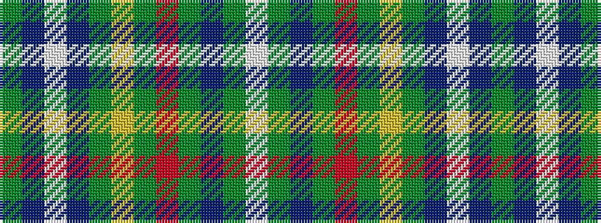

GBWBGYGRGBGW

It is a 12 stripe tartan.

<figure class="pat-woven">

<figcaption>idealised sample</figcaption>
</figure>

## Colour Sequence



## Tartans with this colour sequence

| Tartans |
|---------------|
| [Glasgow Tattoo](/setts/s12/dg40t4lb39t4y4ly4y4r4y34dp4y4w4/)|
||
