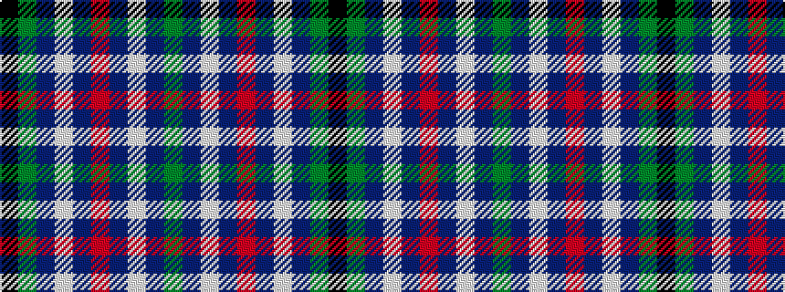

GBWBRBWBGK

It is a 10 stripe tartan.

<figure class="pat-woven">

<figcaption>idealised sample</figcaption>
</figure>

## Colour Sequence



## Tartans with this colour sequence

| Tartans |
|---------------|
| [London Scottish Rugby Club Corporate Sport Tartan](/variants/s10/g8dt13w1dt40r5dt40w1dt13g8k4~x2/)|
||
