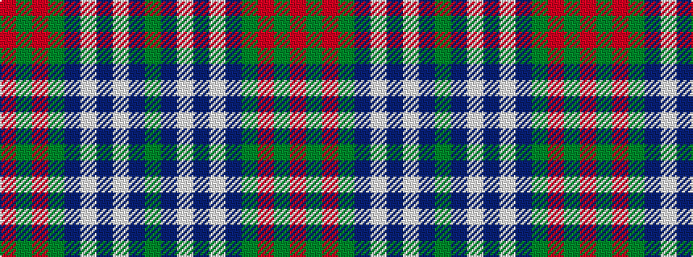

GBWBWBGRGR

It is a 10 stripe tartan.

<figure class="pat-woven">

<figcaption>idealised sample</figcaption>
</figure>

## Colour Sequence



## Tartans with this colour sequence

| Tartans |
|---------------|
| [Strathdee (Personal)](/variants/s10/g25b10w1b5w1b10g25r1g3r2~x2/)|
||
