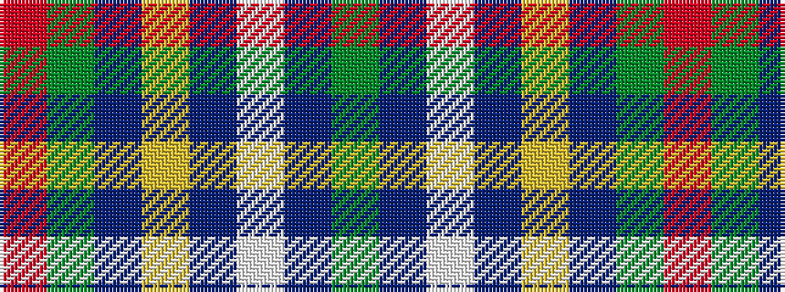

GBWBYBGR

It is a 8 stripe tartan.

<figure class="pat-woven">

<figcaption>idealised sample</figcaption>
</figure>

## Colour Sequence



## Tartans with this colour sequence

| Tartans |
|---------------|
| [Marshall Field](/setts/s8/g10db1w1db1ly1db6g8r1~x8/)|
||
| [Marshall, Fields](/setts/s8/g40db2w2db2ly2db23g32r2~x2/)|
||
