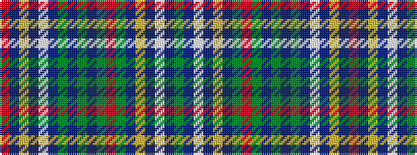

GBWBYBGRGBGBGBWBYBR

It is a 19 stripe tartan.

<figure class="pat-woven">

<figcaption>idealised sample</figcaption>
</figure>

## Colour Sequence



## Tartans with this colour sequence

| Tartans |
|---------------|
| [Mowat, Sir Oliver](/setts/s19/dg6do2lb3do2ly3do2dg6r16dg4do3dg3do3dg16do2lb3do2ly3do2r4~x2/)|
||
