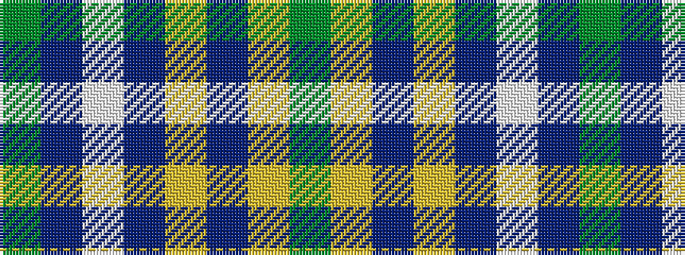

GBWBYBYG

It is a 8 stripe tartan.

<figure class="pat-woven">

<figcaption>idealised sample</figcaption>
</figure>

## Colour Sequence



## Tartans with this colour sequence

| Tartans |
|---------------|
| [Duke of York Hunting](/variants/s8/g99db20w8db30ly8db10ly8g46/)|
||
