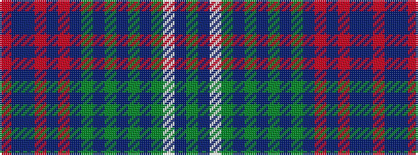

GBWGBGBGBGBRBRBBR

It is a 17 stripe tartan.

<figure class="pat-woven">

<figcaption>idealised sample</figcaption>
</figure>

## Colour Sequence



## Tartans with this colour sequence

| Tartans |
|---------------|
| [Queensferry](/setts/s17/dg6n2lb1dg9dt2dg7dt4dg4dt7dg2dt20r1dt2r1dr3dt3r3~x2/)|
||
