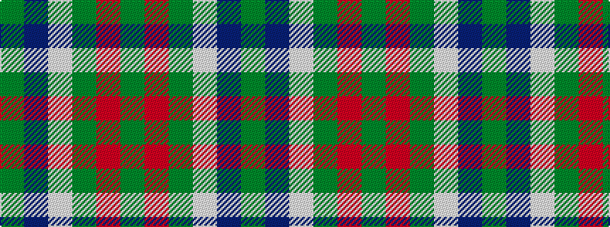

GBWGRG

It is a 6 stripe tartan.

<figure class="pat-woven">

<figcaption>idealised sample</figcaption>
</figure>

## Colour Sequence



## Tartans with this colour sequence

| Tartans |
|---------------|
| [Patterson, John (Personal)](/variants/s6/dgi3db12w1dg12r12dg2~x2/)|
||
| [Patterson, John (Personal)](/variants/s6/g3db12w1dg12r12dg2~x2/)|
||
