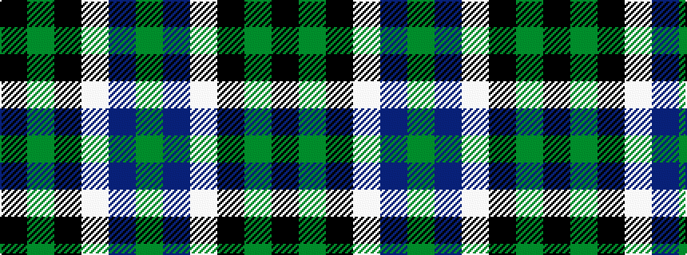

GBWKGK

It is a 6 stripe tartan.

<figure class="pat-woven">

<figcaption>idealised sample</figcaption>
</figure>

## Colour Sequence



## Tartans with this colour sequence

| Tartans |
|---------------|
| [Graham of Montrose](/variants/s6/k4dg19k16w2db15dg4~x2/)|
||
| [Graham of Montrose](/variants/s6/k4g19k16w2db15g4~x2/)|
||
