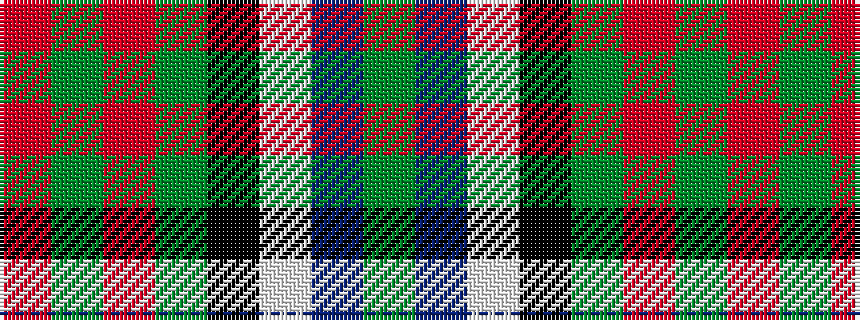

GBWKGRGR

It is a 8 stripe tartan.

<figure class="pat-woven">

<figcaption>idealised sample</figcaption>
</figure>

## Colour Sequence



## Tartans with this colour sequence

| Tartans |
|---------------|
| [Mantle (Personal)](/setts/s8/r3g2r3g18k14w2db16g3~x2/)|
||
