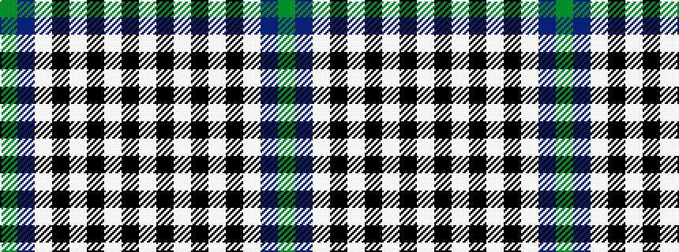

GBWKWKWKW

It is a 9 stripe tartan.

<figure class="pat-woven">

<figcaption>idealised sample</figcaption>
</figure>

## Colour Sequence



## Tartans with this colour sequence

| Tartans |
|---------------|
| [Breton District Tartan](/variants/s9/g6db11w8k4w8k4w8k27w4~x2/)|
||
