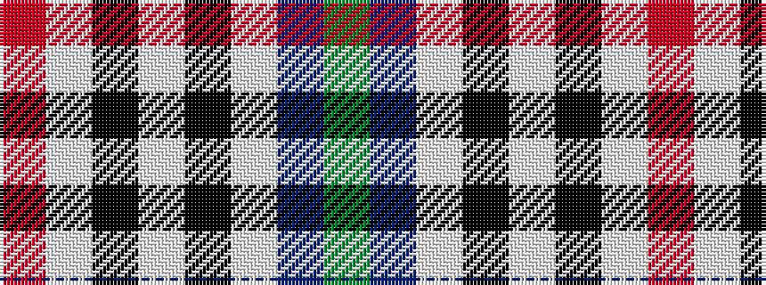

GBWKWKWR

It is a 8 stripe tartan.

<figure class="pat-woven">

<figcaption>idealised sample</figcaption>
</figure>

## Colour Sequence



## Tartans with this colour sequence

| Tartans |
|---------------|
| [Kervegant, Suzanne (Personal)](/variants/s8/g6db11lb8k4lb8k27lb4r4~x2/)|
||
