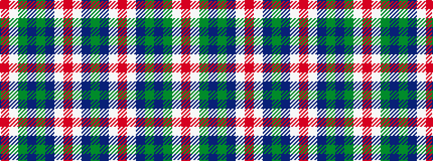

GBWRWBGBGWR

It is a 11 stripe tartan.

<figure class="pat-woven">

<figcaption>idealised sample</figcaption>
</figure>

## Colour Sequence



## Tartans with this colour sequence

| Tartans |
|---------------|
| [McKirgan (Name)](/variants/s11/dg2n2w1r2w1n3dg1n12dg18w1r2~x2/)|
||
| [McKirgan/Mackirgan](/variants/s11/r2w1g18db12g1db3w1r2w1db2g2~x2/)|
||
