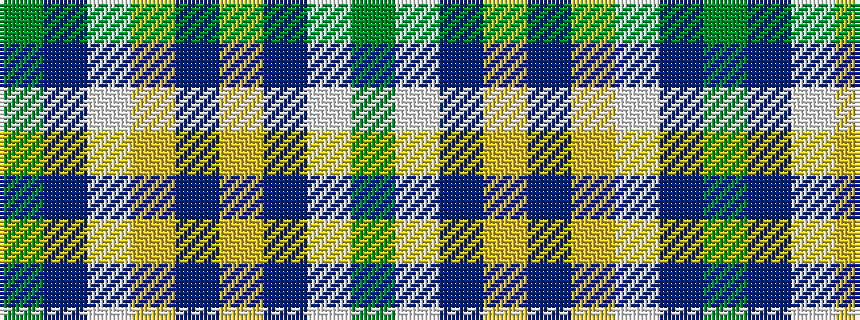

GBWYBYBWG

It is a 9 stripe tartan.

<figure class="pat-woven">

<figcaption>idealised sample</figcaption>
</figure>

## Colour Sequence



## Tartans with this colour sequence

| Tartans |
|---------------|
| [Outlander #2](/variants/s9/y7n6lt1lo6n1lo6n6lt1y6~x8/)|
||
