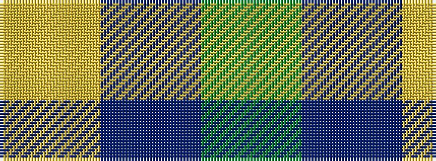

GBY

It is a 3 stripe tartan.

<figure class="pat-woven">

<figcaption>idealised sample</figcaption>
</figure>

## Colour Sequence



## Tartans with this colour sequence

| Tartans |
|---------------|
| [Gearach Woodcock Tweed (Corporate)](/setts/s3/dy2t1lo1~x2/)|
||
| [Unidentified pattern #2](/setts/s3/dg12db3ly1~x4/)|
||
| [Unidentified, pattern](/setts/s3/g12db3ly1~x4/)|
||
