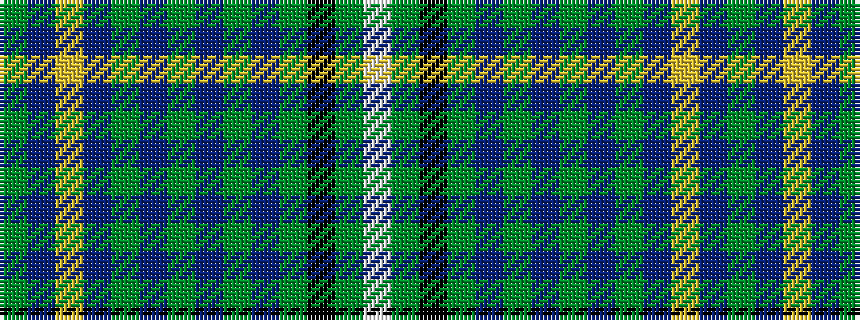

GBYBGBGBGBGKGW

It is a 14 stripe tartan.

<figure class="pat-woven">

<figcaption>idealised sample</figcaption>
</figure>

## Colour Sequence



## Tartans with this colour sequence

| Tartans |
|---------------|
| [Hay Hunting](/variants/s14/g6b4ly2b17g2b2g2b8g26b6g4k2g4w6~x2/)|
||
