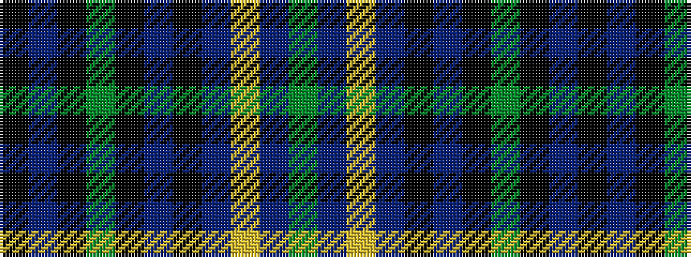

GBYBKBKGKBK

It is a 11 stripe tartan.

<figure class="pat-woven">

<figcaption>idealised sample</figcaption>
</figure>

## Colour Sequence



## Tartans with this colour sequence

| Tartans |
|---------------|
| [Fort William](/setts/s11/y17t2ly2t2k21t2k3y30k2t2k4~x2/)|
||
