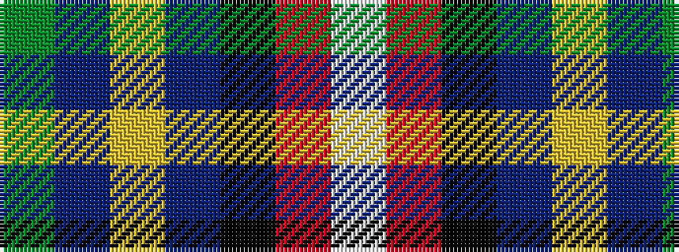

GBYBKRW

It is a 7 stripe tartan.

<figure class="pat-woven">

<figcaption>idealised sample</figcaption>
</figure>

## Colour Sequence



## Tartans with this colour sequence

| Tartans |
|---------------|
| [Devon, Companion](/variants/s7/y5db4ly1db4k4o4w1~x4/)|
||
