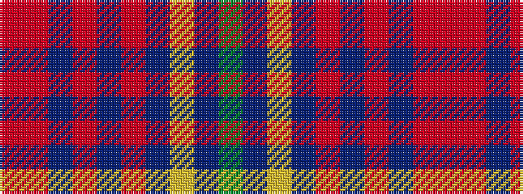

GBYBRBRBRR

It is a 10 stripe tartan.

<figure class="pat-woven">

<figcaption>idealised sample</figcaption>
</figure>

## Colour Sequence



## Tartans with this colour sequence

| Tartans |
|---------------|
| [Yarns to Yearn For](/setts/s10/r3m23b2m2p2m3b28ly2b2g3~x2/)|
||
