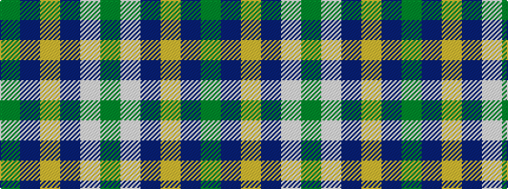

GBYBWG

It is a 6 stripe tartan.

<figure class="pat-woven">

<figcaption>idealised sample</figcaption>
</figure>

## Colour Sequence



## Tartans with this colour sequence

| Tartans |
|---------------|
| [Allanton Dress (Fashion)](/variants/s6/g4w28db14ly2t17g4~x2/)|
||
| [Manx Dress](/variants/s6/g4w28dp8ly2db17g4~x2/)|
||
| [Manx, dress](/variants/s6/g4w28p8ly2db17g4~x2/)|
||
