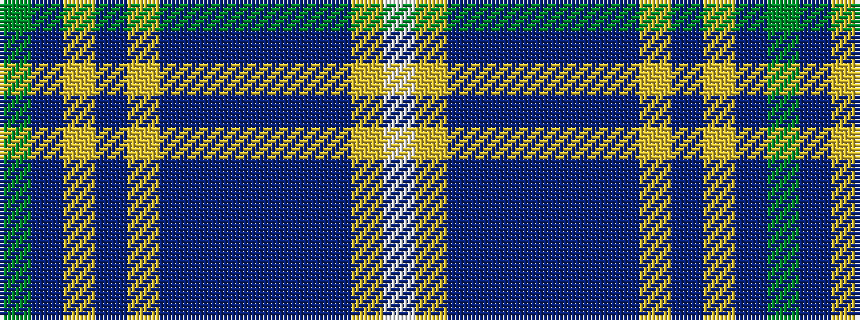

GBYBYBBBBBBYW

It is a 13 stripe tartan.

<figure class="pat-woven">

<figcaption>idealised sample</figcaption>
</figure>

## Colour Sequence



## Tartans with this colour sequence

| Tartans |
|---------------|
| [Scottish Tourist Guides Assoc. (Corp](/setts/s13/dg12dp3lr3dp3lr3dp12db3dp3db2dp2db14lo1w3~x2/)|
||
