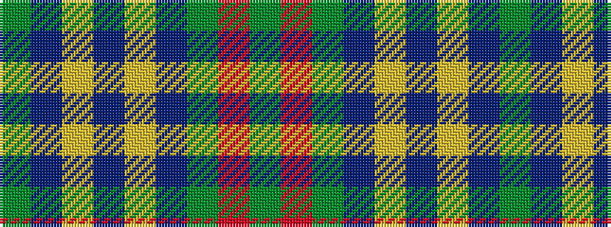

GBYBYBGRG

It is a 9 stripe tartan.

<figure class="pat-woven">

<figcaption>idealised sample</figcaption>
</figure>

## Colour Sequence



## Tartans with this colour sequence

| Tartans |
|---------------|
| [Cork](/variants/s9/g28r12g4db20ly2db3ly2db3g7~x2/)|
||
| [Cork Irish County Tartan](/variants/s9/g28r12g4db20lo2db3lo2db3g7~x2/)|
||
