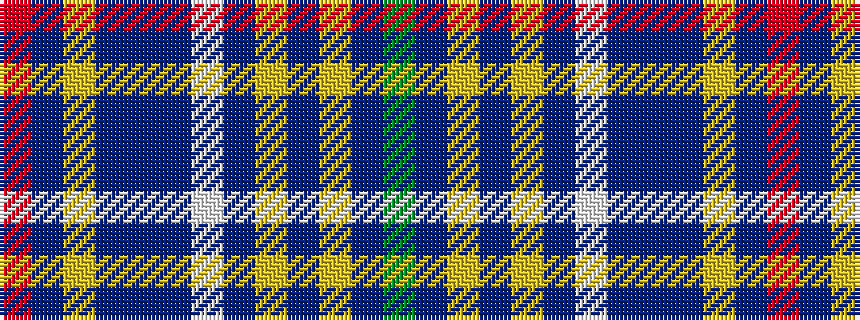

GBYBYBWBBBYBR

It is a 13 stripe tartan.

<figure class="pat-woven">

<figcaption>idealised sample</figcaption>
</figure>

## Colour Sequence



## Tartans with this colour sequence

| Tartans |
|---------------|
| [Registers of Scotland, The (Corp)](/setts/s13/o2dt42lri1dt2n5dt1lb1dt2lr2n3ly1n1y2~x2/)|
||
