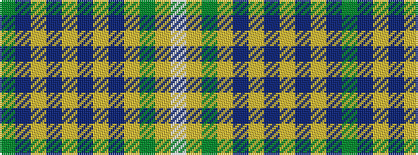

GBYBYBYBYGYW

It is a 12 stripe tartan.

<figure class="pat-woven">

<figcaption>idealised sample</figcaption>
</figure>

## Colour Sequence



## Tartans with this colour sequence

| Tartans |
|---------------|
| [Hand Name Tartan](/variants/s12/dg1n8lr5n23lr5db3lr5dp3lr5dg5lr3w1~x2/)|
||
