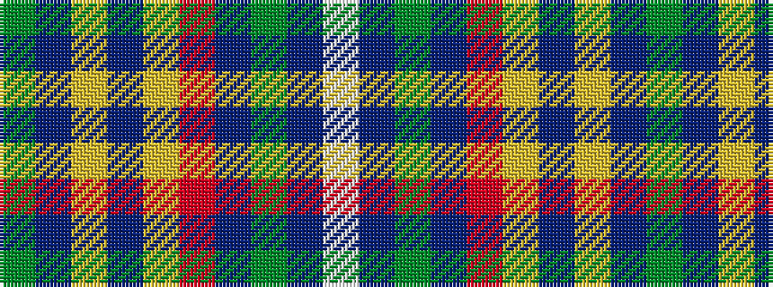

GBYBYRBGBW

It is a 10 stripe tartan.

<figure class="pat-woven">

<figcaption>idealised sample</figcaption>
</figure>

## Colour Sequence



## Tartans with this colour sequence

| Tartans |
|---------------|
| [State Seal of Arizona (Fashion)](/setts/s10/g4do21lo10do5lo4r4db10g6db30lb4~x2/)|
||
