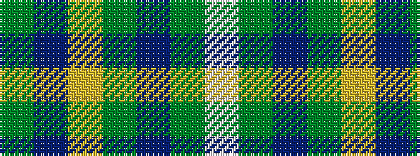

GBYGBGW

It is a 7 stripe tartan.

<figure class="pat-woven">

<figcaption>idealised sample</figcaption>
</figure>

## Colour Sequence



## Tartans with this colour sequence

| Tartans |
|---------------|
| [Chambers Bay](/variants/s7/g2t15lr5g2t2g7w2~x4/)|
||
