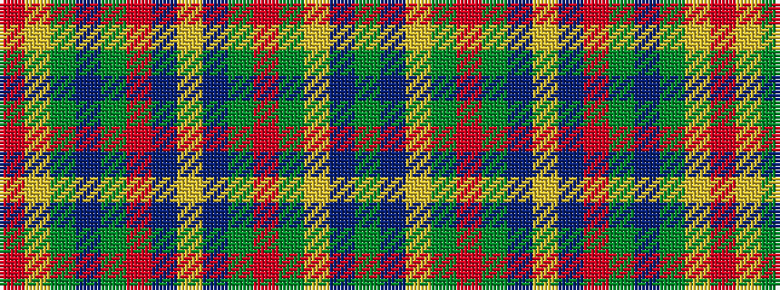

GBYGRGBYBRGBGYR

It is a 15 stripe tartan.

<figure class="pat-woven">

<figcaption>idealised sample</figcaption>
</figure>

## Colour Sequence



## Tartans with this colour sequence

| Tartans |
|---------------|
| [Platt](/setts/s15/g16db6ly2g12r2g14db14ly1db12r2g6db24g6ly2r2~x2/)|
||
| [Platt](/setts/s15/g8db3ly1g6r1g7db7ly1db6r1g3db12g3ly1r1~x2/)|
||
