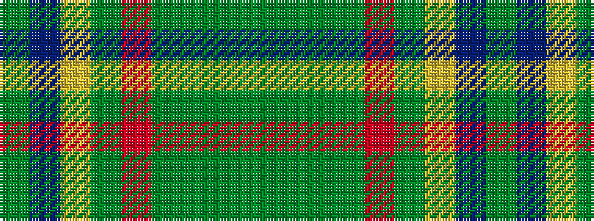

GBYGRGGGG

It is a 9 stripe tartan.

<figure class="pat-woven">

<figcaption>idealised sample</figcaption>
</figure>

## Colour Sequence



## Tartans with this colour sequence

| Tartans |
|---------------|
| [Connemara (District)](/setts/s9/y3dg1g3dg16r32dg1ly1db4g2~x2/)|
||
