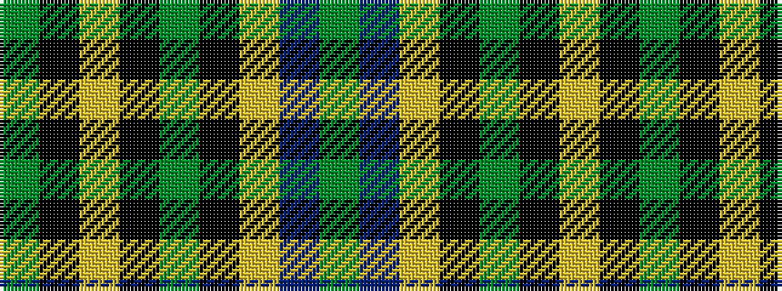

GBYKGKYKG

It is a 9 stripe tartan.

<figure class="pat-woven">

<figcaption>idealised sample</figcaption>
</figure>

## Colour Sequence



## Tartans with this colour sequence

| Tartans |
|---------------|
| [Maine Acadia (Fashion)](/variants/s9/dg5k1ly2k1dg19k15ly2dt20dg3~x2/)|
||
