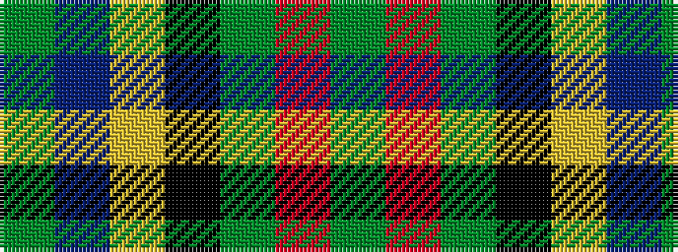

GBYKGRG

It is a 7 stripe tartan.

<figure class="pat-woven">

<figcaption>idealised sample</figcaption>
</figure>

## Colour Sequence



## Tartans with this colour sequence

| Tartans |
|---------------|
| [MacPhadran](/variants/s7/g3db12lr1k12g13r2g2~x2/)|
||
