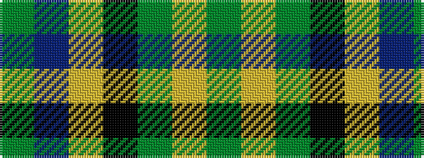

GBYKGYG

It is a 7 stripe tartan.

<figure class="pat-woven">

<figcaption>idealised sample</figcaption>
</figure>

## Colour Sequence



## Tartans with this colour sequence

| Tartans |
|---------------|
| [Rothesay](/variants/s7/g4n12lo2k10y10lo3y2~x2/)|
||
