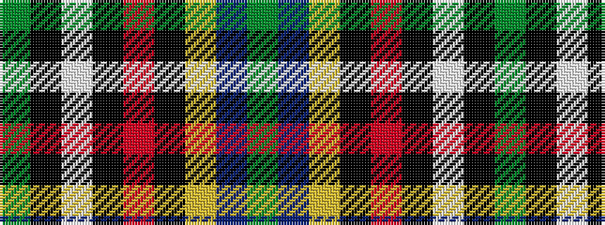

GBYKRKWKG

It is a 9 stripe tartan.

<figure class="pat-woven">

<figcaption>idealised sample</figcaption>
</figure>

## Colour Sequence



## Tartans with this colour sequence

| Tartans |
|---------------|
| [Michael Pellicci (Personal)](/setts/s9/dg60db1lo5k1r15k1w15k1dg15~x2/)|
||
| [Pellicci, Michael (Personal)](/setts/s9/g60db1lo5k1r15k1w15k1g15~x2/)|
||
