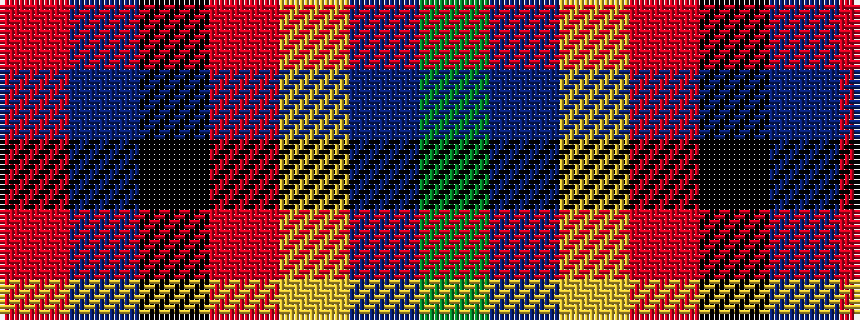

GBYRKBR

It is a 7 stripe tartan.

<figure class="pat-woven">

<figcaption>idealised sample</figcaption>
</figure>

## Colour Sequence



## Tartans with this colour sequence

| Tartans |
|---------------|
| [Gloucester County Pipe Band (Corp)](/variants/s7/g54dt14ly7r14k7dt14r6~x2/)|
||
