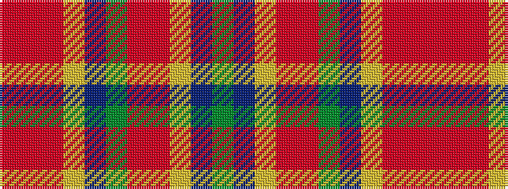

GBYRRGBYRRR

It is a 11 stripe tartan.

<figure class="pat-woven">

<figcaption>idealised sample</figcaption>
</figure>

## Colour Sequence



## Tartans with this colour sequence

| Tartans |
|---------------|
| [Kreutz, Arthur (Personal)](/variants/s11/r8ri8m8ly3db1g1r8m8ly3db1g1~x2/)|
||
