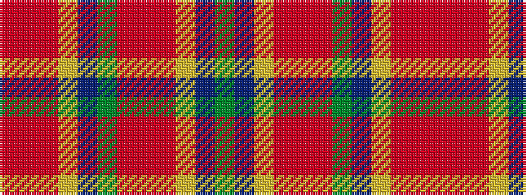

GBYRRRGBYRRR

It is a 12 stripe tartan.

<figure class="pat-woven">

<figcaption>idealised sample</figcaption>
</figure>

## Colour Sequence



## Tartans with this colour sequence

| Tartans |
|---------------|
| [Kreutz, Arthur (Personal)](/setts/s12/r8r8r8lo3t1dg1r8r8r9lo3t1dg1~x2/)|
||
