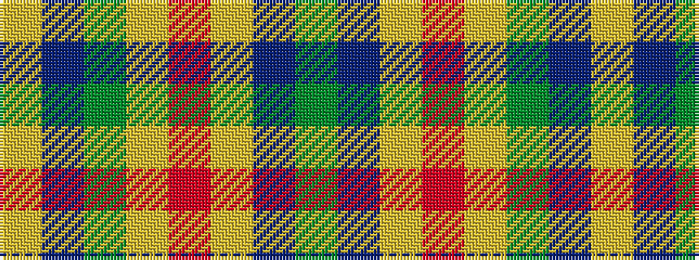

GBYRYGBY

It is a 8 stripe tartan.

<figure class="pat-woven">

<figcaption>idealised sample</figcaption>
</figure>

## Colour Sequence



## Tartans with this colour sequence

| Tartans |
|---------------|
| [Walterstrm (2014))](/setts/s8/g78db13ly6r3ly5g6db9ly6~x2/)|
||
| [Walterström (2014)](/setts/s8/dg78dt13ly6r3ly5dg6dt9ly6~x2/)|
||
