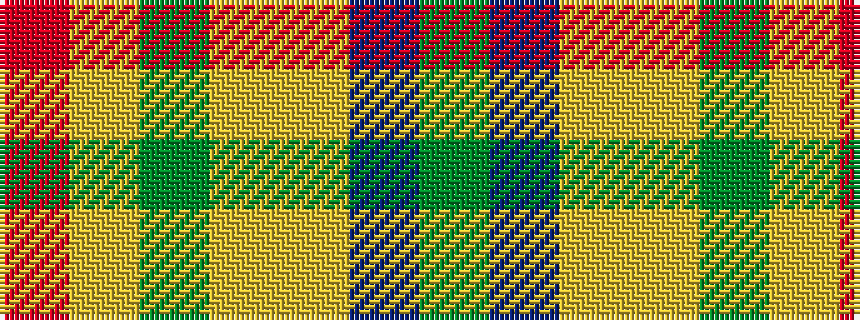

GBYYGYR

It is a 7 stripe tartan.

<figure class="pat-woven">

<figcaption>idealised sample</figcaption>
</figure>

## Colour Sequence



## Tartans with this colour sequence

| Tartans |
|---------------|
| [Loch Ness in Scotland](/variants/s7/g2db14lg6lr1g1lr6r1~x4/)|
||
