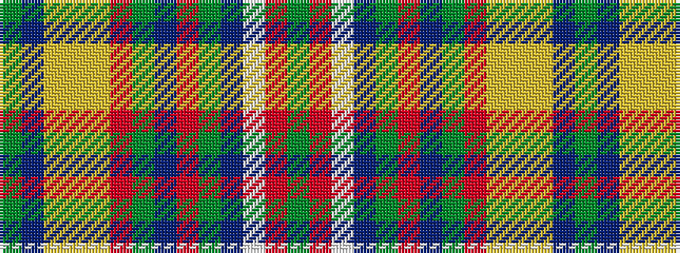

GBYYYRGBRGBWRG

It is a 14 stripe tartan.

<figure class="pat-woven">

<figcaption>idealised sample</figcaption>
</figure>

## Colour Sequence



## Tartans with this colour sequence

| Tartans |
|---------------|
| [Heneghan (Personal)](/setts/s14/g16r3w1db2g4r2db4g2r1lo1ly1lo1db6g12~x4/)|
||
