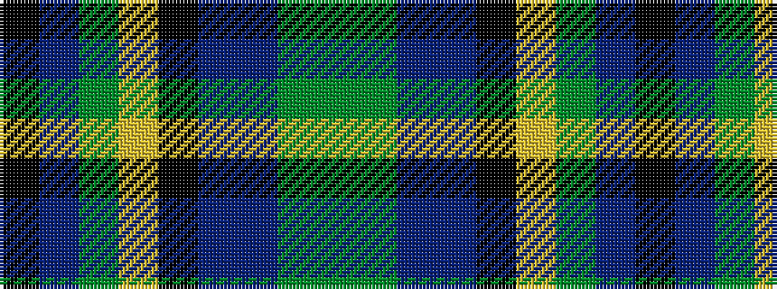

GGBBKYGBK

It is a 9 stripe tartan.

<figure class="pat-woven">

<figcaption>idealised sample</figcaption>
</figure>

## Colour Sequence



## Tartans with this colour sequence

| Tartans |
|---------------|
| [Wilson's, No 225](/setts/s9/g16gi2p13t2k6ly2g16t2k12~x2/)|
||
