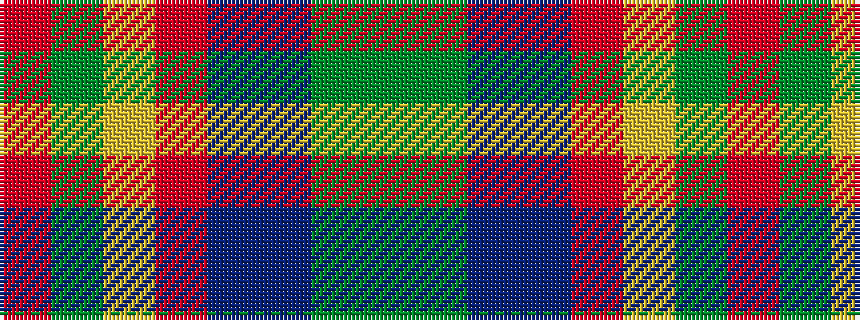

GGBBRYGR

It is a 8 stripe tartan.

<figure class="pat-woven">

<figcaption>idealised sample</figcaption>
</figure>

## Colour Sequence



## Tartans with this colour sequence

| Tartans |
|---------------|
| [Remember the Somme 1916](/setts/s8/dg5g2dbi2db15r2lg2dg5r2~x4/)|
||
