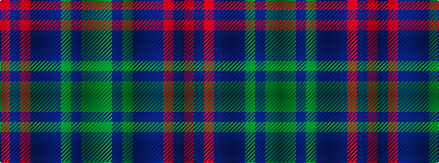

GGBGBBBRBR

It is a 10 stripe tartan.

<figure class="pat-woven">

<figcaption>idealised sample</figcaption>
</figure>

## Colour Sequence



## Tartans with this colour sequence

| Tartans |
|---------------|
| [Donegal](/variants/s10/y3g17db3g3db3dr5db18r2db8r2~x2/)|
||
