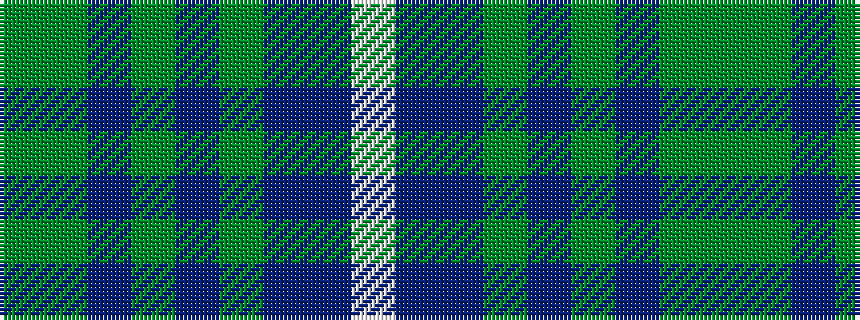

GGBGBGBBW

It is a 9 stripe tartan.

<figure class="pat-woven">

<figcaption>idealised sample</figcaption>
</figure>

## Colour Sequence



## Tartans with this colour sequence

| Tartans |
|---------------|
| [Cowal Gathering](/variants/s9/dg2g8dt1g1dt1g1dt8db10w1~x4/)|
||
