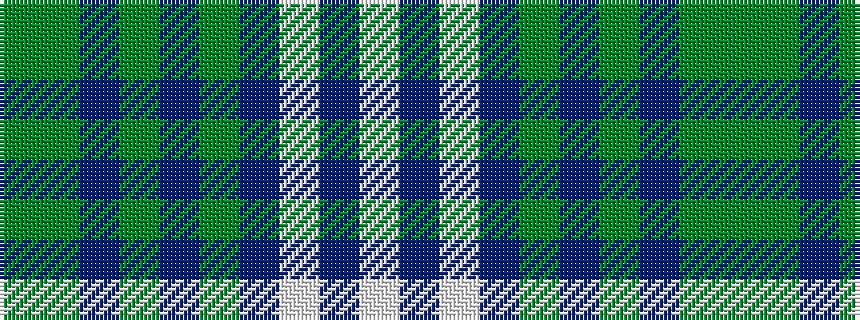

GGBGBGBWBW

It is a 10 stripe tartan.

<figure class="pat-woven">

<figcaption>idealised sample</figcaption>
</figure>

## Colour Sequence



## Tartans with this colour sequence

| Tartans |
|---------------|
| [Tweedsmuir Dress (Dance)](/setts/s10/g1y15dp1y1dp1y2dp6w15t1w1~x4/)|
||
