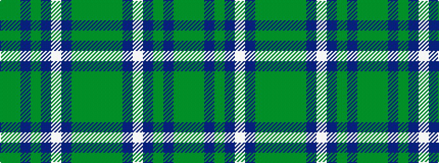

GGBGBWBGGG

It is a 10 stripe tartan.

<figure class="pat-woven">

<figcaption>idealised sample</figcaption>
</figure>

## Colour Sequence



## Tartans with this colour sequence

| Tartans |
|---------------|
| [MacScott Family (America) (Personal)](/variants/s10/g23dy5db13g5db5w3db5g5dy9g9~x2/)|
||
