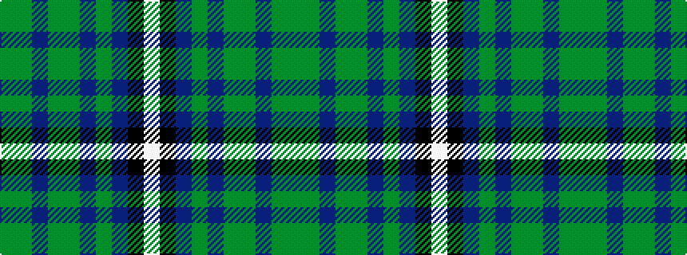

GGBGGBGBKW

It is a 10 stripe tartan.

<figure class="pat-woven">

<figcaption>idealised sample</figcaption>
</figure>

## Colour Sequence



## Tartans with this colour sequence

| Tartans |
|---------------|
| [Camenisch Enveglan Family (Personal)](/setts/s10/dgi28dg6dt4dg6dgi5dp4dgi5dt11k1w2~x2/)|
||
