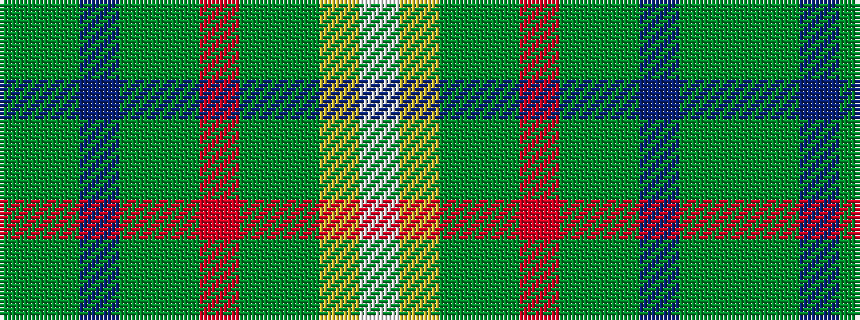

GGBGGRGGYW

It is a 10 stripe tartan.

<figure class="pat-woven">

<figcaption>idealised sample</figcaption>
</figure>

## Colour Sequence



## Tartans with this colour sequence

| Tartans |
|---------------|
| [Mississippi District Tartan Tartan Number: 6789. Earliest known date: 2005 Karen M Green of the Mississippi Gulf Coast Scottish Highland Games and Celtic Music Festival designed the tartan using the House of Tartan online tartan designer. She hopes to get the approval of the MS State Legislature to adopt the tartan as the Mississippi State tartan. See products available Copyright © Blair Urquhart, Comrie, 2015](/setts/s10/dg5g10dt1dg5g5r2dg5g5ly1w1~x2/)|
||
