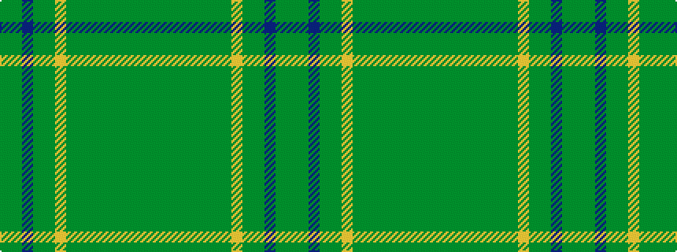

GGBGGYGGGGGGGG

It is a 14 stripe tartan.

<figure class="pat-woven">

<figcaption>idealised sample</figcaption>
</figure>

## Colour Sequence



## Tartans with this colour sequence

| Tartans |
|---------------|
| [Stewart Camel (Lochcarron)](/setts/s14/y3dy3dg2dy6yi7dg2y3dg2lo3dg5y3b3y20dy2~x2/)|
||
