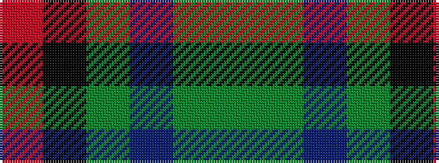

GGBGKR

It is a 6 stripe tartan.

<figure class="pat-woven">

<figcaption>idealised sample</figcaption>
</figure>

## Colour Sequence



## Tartans with this colour sequence

| Tartans |
|---------------|
| [Gorman, George (Personal)](/setts/s6/dg9g1dp2g1k4r1~x12/)|
||
