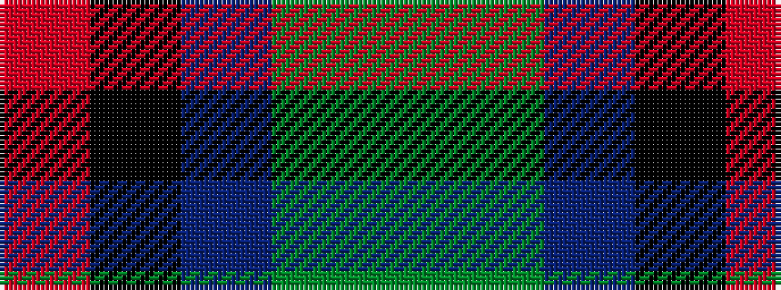

GGBKR

It is a 5 stripe tartan.

<figure class="pat-woven">

<figcaption>idealised sample</figcaption>
</figure>

## Colour Sequence



## Tartans with this colour sequence

| Tartans |
|---------------|
| [Holehouse, Dag (Personal)](/setts/s5/g22dy40n8k9o1~x2/)|
||
