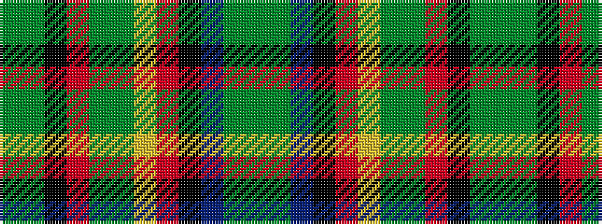

GGBKRYGGRKGG

It is a 12 stripe tartan.

<figure class="pat-woven">

<figcaption>idealised sample</figcaption>
</figure>

## Colour Sequence



## Tartans with this colour sequence

| Tartans |
|---------------|
| [MacCamley Clan Tartan](/variants/s12/dg29g16k8r4dg16g16ly4r4k16t4g28dg16/)|
||
